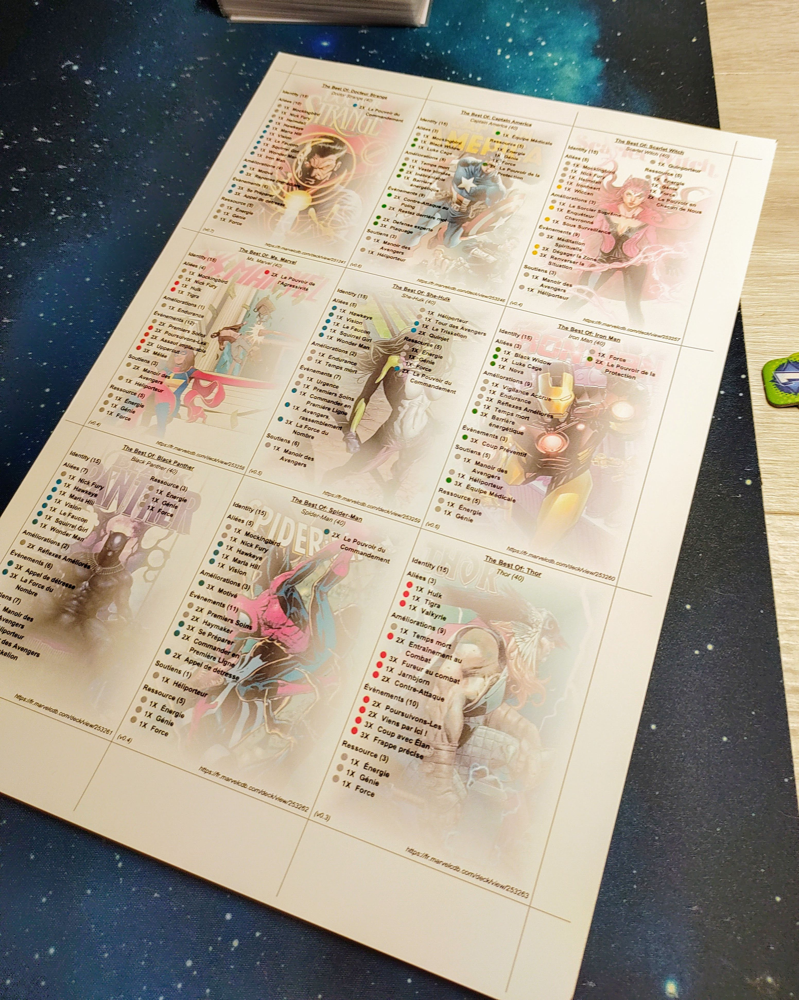

# mcdeck

Generates help cards containing the list of cards for the given decks.



The generated document is a 'pdf' file.

This script use decks from the [MarvelCDB](https://marvelcdb.com) site, and more precisely, it uses decks from the "My Decks" section of user account.

## Prerequisites

### Python Instalation

- Install Python : https://www.python.org/downloads/
- Install FPDF module: 
    > pip3 install fpdf
- Install Request module: 
    > pip install requests
- Install tqdm module:
    > pip install tqdm     

### MarvelCDB account setup

In order to use this script it is recomended to create an account on marvelCDB web site and enable the `Share your decks` option from the `Edit account` page.


Now you can select deck form your deck list and note the *id* at the end of the page name.


## Usage

The script to execute is `mcdeck.py`

Display usage with the following command:

> python mcdeck.py --help

```
usage: mcdeck.py [-h] [-l {de,es,fr,it}] [-s {by_type,by_set}] [-po {P,L}] [-pf {A3,A4,A5,Letter,Legal}] [-u] [-b] [-bd BACKGROUND_DIR] [-ifs {B,I,BI}]
                 [-a {public}] [-i INPUT] [-v]
                 [ID ...]

Generate deck cards pdf document from a marvelcdb.com deck ID list.

positional arguments:
  ID                    Optional list of deck Ids

options:
  -h, --help            show this help message and exit
  -l {de,es,fr,it}, --language {de,es,fr,it}
                        Language to use. By default 'en'.
  -s {by_type,by_set}, --sort {by_type,by_set}
                        How to sort sections.By default sort by type
  -po {P,L}, --page_orientation {P,L}
                        Default page orientation. Portrait or Landscape. By default Portrait (P)
  -pf {A3,A4,A5,Letter,Legal}, --page_format {A3,A4,A5,Letter,Legal}
                        The format used for pages. By default A4
  -u, --unfold          To unfold the identity section. By default the section is 'Folded'.
  -b, --background      Set background feature to 'on'. By default the feature is 'off'
  -bd BACKGROUND_DIR, --background_dir BACKGROUND_DIR
                        To specify where to find background Image. By default in 'resource/background'
  -ifs {B,I,BI}, --item_font_style {B,I,BI}
                        Set font style for item text. By default no style is applied.
  -a {public}, --api {public}
                        Kind of API endpoint to use. By default the 'public' api is used. For instance only public api is supported.
  -i INPUT, --input INPUT
                        Input text file containing a list of deck Id. (One Id by line)
  -v, --version         show program's version number and exit
  ```

## Exemples

### Exemple 1

Use 1 or more ids to generate deck cards on "./output/output.pdf".

> python mcdeck.py 260621 260622 26062


### Exemple 2

Use ids in ["./input/sample.txt"](/input/sample.txt) to generate deck cards on "./output/sample.pdf" 

**Note the identical name for both files (sample.txt and sample.pdf).**

> python mcdeck.py -i input/sample.txt

### Exemple 3

Use ids in ["./input/sample.json"](/input/sample.json) to generate deck cards on "./output/sample.pdf" 

**Enumerating the list of id in a json file allows to change the title of the decks.**

> python mcdeck.py -i input/sample.json


### Exemple 4

Use ids from  ["./input/sample.json"](/input/sample.json) with some command line arguments to generate deck cards on "./output/sample.pdf" 

| argument  | meaning |
|:-------------|:-------------|
| `-l fr`      | Generate french version          |
| `-s by_set`  | Sort list by set                 |
| `-u`         | Unfold Identity section          |
| `-ifs B`     | Use Bold style for section items |

> python mcdeck.py -i input/sample.json -l fr -s by_set -u -ifs B


**⚠️ Note, on Adam Warlock's deck, that using the unfold option produces a display bug. This option should be used with caution**

### Exemple 5

Use background option to use background image from ["resources/background"](/resources/background/)

| argument  | meaning |
|:-------------|:-------------|
| `-b`      | Use background image on  ./resources/background |

> python mcdeck.py -i input/sample.json -b 


**Another background directory can be specified with argument -bd**

### Exemple 6

Select a pdf page format other than A4 Portrait.

| argument  | values        | meaning |
|:----------|:--------------|:-------------|
| `- po`    | P or L        | Default page orientation. Portrait (P) or Landscape (L). By default Portrait |
| `- pf`    | A3, A4, A5, Letter or Legal | The format used for pages. By default A4 |

> python mcdeck.py -i input/sample.json -po L -pf Letter